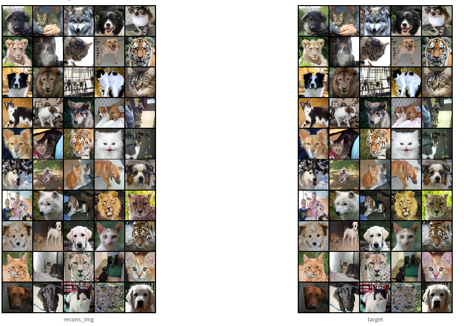

# **Diffusion and Flow Matching Models**

## **1. Introduction**
Diffusion model is a type of generative model. Its approach is different from GAN, VAE and Flow-based models. In my repository, I re-setup diffusion model from scratch to do some experiments:
* Diffusion Model: Training with simple loss
* Inference with DDPM and  DDIM
* Using (label, image, text) as condition for diffusion model
* Latent diffusion: Image space to latent space with VAE
* Stable diffusion: Latent + Condition Diffusion
* Classifier-free guidance
* Sketch2Image: using condition as sketch image
* Medical Image Segmentation: using condition as medical image

On the other hand, Flow Matching is currently better than the Diffusion Model in serveral tasks. In my repository, i used the library from Meta Research Team to run some experiments.  

## **2. Set Up**

  ### **Clone the repository**
    git clone https://github.com/hanhNK1604/diffusion.git
    
  ### **Install environment packages**
    cd diffusion
    conda create -n diffusion python=3.10
    conda activate diffusion 
    pip install -r requirements.txt

  ### **Training**
  set-up CUDA_VISIBLE_DEVICES and WANDB_API_KEY before training
  
    export CUDA_VISIBLE_DEVICES=0
    export WANDB_API_KEY=???
    cd src
    python train.py 
  
  there are several config file, folder should be modified to run the achieved experiment such as configs/data, logger, model, trainer, train.yaml 
  
  ### **Inference**
    ...

## **3. Diffusion Model**

### **3.1. Dataset**

  - **Generation task**:
    - MNIST, FASHION-MNIST: 28x28 pixels
    - CIFAR10: 32x32 pixels
    - [GENDER](https://www.kaggle.com/datasets/yasserhessein/gender-dataset): 64x64 pixels
    - [CELEBA](https://www.kaggle.com/datasets/badasstechie/celebahq-resized-256x256): 256x256 pixels 
    - [AFHQ](https://www.kaggle.com/datasets/andrewmvd/animal-faces), [FFHQ](https://www.kaggle.com/datasets/greatgamedota/ffhq-face-data-set): 512x512 pixels
  
  - **Segmentation task**:
    - [LIDC-IDRI](https://wiki.cancerimagingarchive.net/pages/viewpage.action?pageId=1966254)
    - [CVC-CLINIC](https://www.kaggle.com/datasets/balraj98/cvcclinicdb)
    - [ISIC](https://challenge.isic-archive.com/data/)
  
### **3.2. Attention**
  - Self Attention
  - Cross Attention
  - Spatial Transformer
  
### **3.3. Backbone**
  - ResNet Block
  - VGG Block
  - DenseNet Block
  - Inception Block

### **3.4 Embedder**
  - Time
  - Label: animal (dog, cat), number (0,1,...9), gender (male, female)
  - Image: Sketch2Image, Segmentation
  - Text: not implemented

### **3.5. Sampler**
  - DDPM: Denoising Diffusion Probabilistic Models
  - DDIM: Denoising Diffusion Implicit Models

### **3.6. Model**
  - Unet: Encoder, Decoder
  - Unconditional Diffusion Model
  - Conditional diffusion model (label, image, text - need to implement text embedder model)
  - Variational autoencoder: Vanilla (only work for reconstruction), VQ
  - Latent diffusion model
  - Stable diffusion model
  - Classifier-free; not work

## **4. Flow Matching Model** 

In this repository, Flow Matching Model use the same unconditional, conditional backbone UNet with Diffusion Model

## **5. RESULTS**

### **5.1. Conditional Flow Matching Model on MRI**

The MRI Image is so important in the medical field, which can provide the information to doctor for diagnosing some diseases about brain like Cancer,... I have implemented the generation tasks on MRI based on age to produce some synthetic data. 

  

### **5.2. Unconditional Diffusion**

| Dataset  | Image-Size | FID (features=2048, ddim -> ddpm) |
| :---: | :---: | :---: |
| Mnist |  32x32  | 2.65 -> 0.89 | 
| Fashion-Mnist | 32x32 | 3.31 -> 2.42 |
| Cifar10 | 32x32 | 5.54 -> 3.58 | 

      

### **5.3. Conditional Diffusion**

| Dataset  | Image-Size | FID (features=2048, ddim -> ddpm) |
| :---: | :---: | :---: | 
| Mnist |  32x32  | 3.91 -> 1.16 | 
| Fashion-Mnist | 32x32 | 3.10 -> 2.15 | 
| Cifar10 | 32x32 | 5.66 -> 3.37 | 
| Gender | 64x64 | 3. | 
| CelebA | 64x64 | 3. | 
  
 

 

-  Image Super Resolution (Low Resolution, Reconstructed Image, High Resolution)

  

- Sketch2Image (Sketch, Fake, Real)
  
  

### **5.4 DDPM and DDIM**

#### **DDPM (64x64)**

#### **DDIM (64x64)**

### **5.5 DIFFUSION INTERPOLATION (64x64)**

### **5.6 VAE RECONSTRUCTION**
#### **CIFAR10**

#### **AFHQ**

#### **GENDER**

#### **CELEBA**

### **5.7 VAE INTERPOLATION**
#### **CIFAR10 (32x32)**

#### **AFHQ (64x64)**

#### **CELEBA (128x128)**

### **5.8 Latent Diffusion**
#### **GENDER (128x128)**

#### **AFHQ (256x256)**

